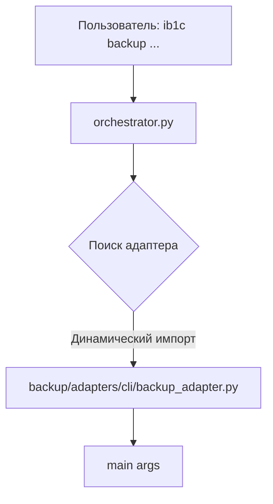

# Сервис `backup` — создание резервных копий информационных баз 1С

## 🎯 Назначение

Сервис `backup` обеспечивает **надёжное создание** резервных копий информационных баз 1С с поддержкой двух форматов:

- **`.dump`** — PostgreSQL Custom Format (бинарный, оптимальный для восстановления)
- **`.sql.gz`** — Архивированный SQL (текстовый, удобен для анализа и переноса)

Ключевые особенности:

- Прогресс-бар в реальном времени через `pv` (с обёрткой `script` для избежания ошибки `[Errno 1]`)
- Адаптивный таймаут (5 минут на каждый ГБ данных + запас)
- Проверка дискового пространства перед массовым бэкапом
- Ранняя валидация существования ИБ (до создания директории)
- Защита от частичных бэкапов при нехватке места (автоочистка)
- Человекочитаемая диагностика ошибок с подсказками

## 📁 Файловая структура

```
/opt/1cv8/scripts/
├── core/                          # Общие компоненты проекта
│   ├── engine.py                  # run_engine() — запуск bash-скриптов
│   ├── exceptions.py              # Кастомные исключения (BackupError, BackupTimeoutError)
│   ├── utils.py                   # Вспомогательные функции (парсинг дат)
│   └── config.py                  # Глобальные настройки (BACKUP_TIMEOUT_MINUTES_PER_GB, BACKUP_TIMEOUT_MINIMUM)
├── engines/
│   └── config/
│       └── global.sh              # Глобальные настройки: BACKUP_ROOT, PG_HOST, PG_PORT, PG_USER, PGPASS_FILE
└── backup/                        # 📦 Домен: бэкапы
    ├── engines/
    │   └── backup.sh              # Bash-скрипт бэкапа (работает от usr1cv8)
    ├── services/
    │   ├── __init__.py
    │   └── backup_service.py      # Бизнес-логика: backup_ib(), backup_multiple(), estimate_backup_size(), check_disk_space()
    └── adapters/
        └── cli/
            ├── __init__.py
            └── backup_adapter.py  # CLI-адаптер: argparse → валидация → вызов сервиса
```

## 🚀 Примеры команд

```bash
# Бэкап одной ИБ в формате dump
ib1c backup -f dump -I artel_2025

# Бэкап всех ИБ из списка (с проверкой места)
ib1c backup -f dump -A

# Симуляция бэкапа всех ИБ (оценка места)
ib1c backup -f dump -A -n

# Бэкап в формате sql.gz
ib1c backup -f sql -I artel_2025
```

## 🔗 Алгоритм работы и зависимости

### 1. Точка входа: `orchestrator.py`



### 2. CLI-адаптер: `backup_adapter.py`

- **Парсинг аргументов** через `argparse`:
  - `-f/--format` — формат бэкапа (`dump` или `sql`) (обязательный)
  - `-I/--ib` — имя ИБ (обязательный, если не `-A`)
  - `-A/--all` — бэкап всех ИБ из `ib_list.conf`
  - `-n/--dry-run` — симуляция (только оценка места)
- **Валидация**:
  - Проверка взаимоисключающих флагов (`-I` vs `-A`)
  - Для `--all` или `--dry-run`: вызов `check_disk_space()` для оценки места
- **Вызов сервиса**: `backup_service.backup_multiple(ib_list, format_type, dry_run)`

### 3. Сервисный слой: `backup_service.py`

```python
def backup_ib(ib_name: str, format_type: str, dry_run: bool) -> dict:
    # 1. Предварительная проверка: существует ли ИБ?
    size_check = get_ib_size(ib_name)
    if size_check == -1:  # Специальный код: ИБ не найдена
        return {"success": False, "stderr": "❌ ИБ не найдена в кластере БД..."}

    # 2. Расчёт адаптивного таймаута
    timeout = estimate_backup_timeout(ib_name, size_check)

    # 3. Запуск через ядро
    result = run_engine(
        "backup/engines/backup.sh",
        ["--ib", ib_name, "--format", format_type],
        timeout=timeout,
        user="usr1cv8",
        capture_output=False  # Для прогресс-бара
    )

    # 4. Улучшение диагностики ошибок
    if not result["success"]:
        stderr = result.get("stderr", "").lower()
        if "не найдена в кластере бд" in stderr:
            result["stderr"] = "❌ ИБ не найдена..."
        elif "нет места" in stderr:
            result["stderr"] = "❌ Недостаточно места на диске..."
        # ... остальные типы ошибок ...

    return {
        "success": result["success"],
        "ib_name": ib_name,
        "stderr": result["stderr"]
    }

def backup_multiple(ib_list: list, format_type: str, dry_run: bool) -> list:
    # Последовательная обработка каждой ИБ
    return [backup_ib(ib, format_type, dry_run) for ib in ib_list]

def check_disk_space(ib_list: list, format_type: str) -> dict:
    # Оценка суммарного размера бэкапов + запас 0.5 ГБ
    # Возвращает: {"sufficient": bool, "required_gb": float, "free_gb": float, "message": str}
```

### 4. Bash-скрипт: `backup/engines/backup.sh`

- **Загрузка конфигурации**: `source /opt/1cv8/scripts/engines/config/global.sh`
- **Ранняя валидация ИБ** (ДО создания директории):
  ```bash
  if ! PGPASSFILE="$PGPASS_FILE" psql -h "$PG_HOST" ... -tAc "SELECT 1 FROM pg_database WHERE datname = '$IB_NAME'" | grep -q "1"; then
    echo "❌ ИБ '$IB_NAME' не найдена в кластере БД..." >&2
    exit 1
  fi
  ```
- **Создание директории**: `mkdir -p "$BACKUP_ROOT/$IB_NAME/$TIMESTAMP"`
- **Выполнение бэкапа**:
  - Для `.dump`: `pg_dump -Fc | pv | tee backup.dump`
  - Для `.sql.gz`: `pg_dump | gzip | tee backup.sql.gz`
- **Проверка целостности**: Убедиться, что файл создан и не пустой
- **Автоочистка при ошибке** (через `trap cleanup_on_error EXIT`):
  ```bash
  cleanup_on_error() {
    if [[ $? -ne 0 ]] && [[ -d "$BACKUP_DIR" ]]; then
      rm -rf "$BACKUP_DIR" 2>/dev/null || true
    fi
  }
  trap cleanup_on_error EXIT
  ```

### 5. Интеграция с ядром

- `core/engine.py` запускает `backup.sh` через `subprocess`
  - Для прогресс-бара: `capture_output=False` + обёртка `script` при смене пользователя
  - Для таймаута: выбрасывает `BackupTimeoutError` при превышении лимита
- `core/exceptions.py` предоставляет `BackupTimeoutError` с понятным сообщением
- `core/config.py` хранит параметры таймаута: `BACKUP_TIMEOUT_MINUTES_PER_GB`, `BACKUP_TIMEOUT_MINIMUM`

## 🛡️ Таблица ошибок и обработки

| Ошибка                              | Причина                                   | Обработка                                                | Сообщение пользователю                                                   |
| ----------------------------------- | ----------------------------------------- | -------------------------------------------------------- | ------------------------------------------------------------------------ |
| ИБ не найдена                       | Указано несуществующее имя                | `backup.sh` проверяет до создания директории             | `❌ ИБ 'имя' не найдена в кластере БД 10.129.0.27:5432`                  |
| Недостаточно места                  | Диск заполнен во время записи             | `backup.sh` удаляет неполный файл, возвращает код ошибки | `❌ Недостаточно места на диске для бэкапа ИБ 'имя'`                     |
| Таймаут                             | Бэкап не завершился за рассчитанное время | `core/engine.py` выбрасывает `BackupTimeoutError`        | `❌ Прервано по таймауту: бэкап ИБ 'имя' (~X ГБ) не завершился за Y мин` |
| Ошибка подключения к БД             | Сетевая проблема, СУБД недоступна         | `backup.sh` возвращает код ошибки                        | `❌ Не удалось подключиться к кластеру БД 10.129.0.27:5432`              |
| Ошибка аутентификации               | Неверный пароль в `.pgpass`               | `backup.sh` возвращает код ошибки                        | `❌ Ошибка аутентификации при подключении к БД`                          |
| Нехватка места для массового бэкапа | Оценка показала недостаток места          | `backup_adapter.py` прерывает выполнение до запуска      | `❌ НЕДОСТАТОЧНО места для бэкапа X ИБ: Требуется Y ГБ, Свободно Z ГБ`   |
| Ошибка записи (частичный бэкап)     | Диск заполнился во время записи           | `backup.sh` удаляет неполный файл через `trap`           | `❌ Фатальная ошибка: файл бэкапа отсутствует или пустой`                |

## 💡 Ключевые принципы

- **Безопасность по умолчанию**: Валидация ИБ до создания директории, автоочистка при ошибках
- **Прозрачность**: Прогресс-бар в реальном времени, понятные сообщения об ошибках
- **Адаптивность**: Таймаут и оценка места рассчитываются динамически на основе размера ИБ
- **Надёжность**: Защита от частичных бэкапов, проверка целостности файла после записи
- **Производительность**: Использование бинарного формата `.dump` для минимизации времени бэкапа

[ВЕРНУТЬСЯ В README.md](././)
