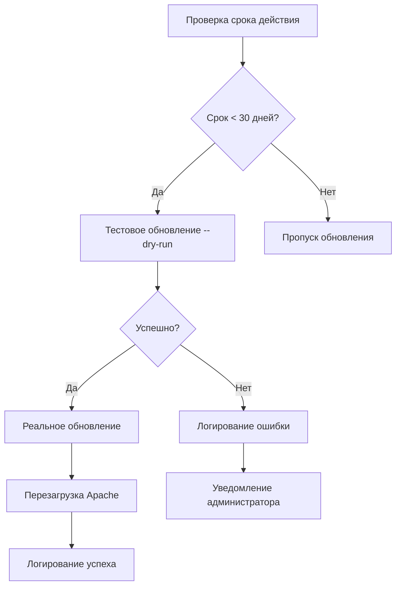

# 🤖 Промпты для генерации кода и документации

Набор шаблонных запросов для ИИ-ассистента (Qwen3-Max и аналоги) при разработке и поддержке проекта.

---

## 🔐 Обязательный преамбула для всех промптов

Перед любым запросом добавляйте контекст окружения:

Контекст проекта:

- ОС: Ubuntu 18.04 LTS
- 1С:Предприятие 8.3.27.1989 (на момент создания сервисов)
- Пользователь кластера: usr1cv8
- Архитектура: гибридная (Python 3.11 для управления + Bash для низкоуровневых операций)
- Структура проекта: /opt/1cv8/scripts/{admin1c.py, lib/, engines/, docs/}
- Требования безопасности: никаких паролей в коде, все привилегированные операции через sudo в изолированных Bash-скриптах

---

## 📌 Промпты для генерации кода

### 1. Создание нового Bash-движка

Создай Bash-скрипт для движка engines/<имя>.sh с требованиями:

- Все системные вызовы через sudo
- Логирование в /var/log/1c-admin/<имя>.log через функцию log()
- Обработка ошибок через функцию error() с exit 1
- Поддержка аргументов командной строки (--параметр значение)
- Проверка существования критических файлов/директорий перед операциями
- Пример использования: ./<имя>.sh --action check --target имя_иб

### 2. Расширение CLI в admin1c.py

Дополни admin1c.py новой подкомандой '<имя>' с требованиями:

- Использовать существующую функцию run_engine() для вызова движка
- Добавить аргументы через argparse с валидацией
- Извлекать конфигурацию из lib/config.py (не хардкодить пути/домены)
- Поддерживать --dry-run для тестовых прогонов
- Пример вызова: python admin1c.py <имя> --action check --target имя_иб

### 3. Безопасная работа с паролями

Как безопасно передать пароль от СУБД в команду pg_dump без отображения в ps и истории?  
Требования:

- Не использовать переменные окружения в открытом виде
- Не передавать пароль в аргументах командной строки
- Использовать .pgpass с правильными правами (600)
- Показать пример кода на Bash с временным файлом и автоматической очисткой

---

## 📝 Промпты для генерации документации

### 1. Описание нового сервиса

Создай структуру документации для нового сервиса '<имя>' в формате Markdown:

- Заголовок с эмодзи и кратким описанием
- Архитектурная схема (компоненты и их расположение)
- Алгоритм работы (шаги с примерами команд)
- Таблица «Технические причины» (почему реализовано именно так)
- Раздел «Критические замечания» с таблицей правил безопасности
- Примеры использования через единую точку входа
- Диагностика проблем (распространённые ошибки + решения)

### 2. Обновление существующего .md-файла

Дополни файл docs/<имя>.md разделом «Автоматизация через cron»:

- Укажи реальный путь к заданию (crontab -u usr1cv8 -l)
- Приведи строку cron с пояснением синтаксиса
- Добавь таблицу с расшифровкой элементов расписания
- Упомяни лог-файл для мониторинга результатов

### 3. Генерация диаграмм

````markdown
### Алгоритм обновления сертификата


````

---

## ⚠️ Критически важные правила для промптов

| Правило                       | Пример плохого запроса     | Пример хорошего запроса                                          |
| ----------------------------- | -------------------------- | ---------------------------------------------------------------- |
| **Указывайте версию ОС**      | «Как настроить бэкап?»     | «Как настроить бэкап на Ubuntu 18.04 с PostgreSQL 11?»           |
| **Уточняйте пользователя**    | «Запусти скрипт»           | «Запусти скрипт от имени usr1cv8 через sudo -u»                  |
| **Требуйте безопасность**     | «Покажи команду с паролем» | «Покажи безопасную передачу пароля через .pgpass»                |
| **Ссылайтесь на архитектуру** | «Напиши скрипт»            | «Напиши движок для engines/ с логированием в /var/log/1c-admin/» |

---

## 💡 Советы по использованию

1. **Копируйте промпт целиком** — включая преамбулу с контекстом
2. **Заменяйте `<имя>`** на реальное название сервиса/скрипта
3. **Всегда проверяйте** сгенерированный код на безопасность перед применением
4. **Дополняйте промпты** спецификой вашей среды (например, внутренние IP-адреса БД)
