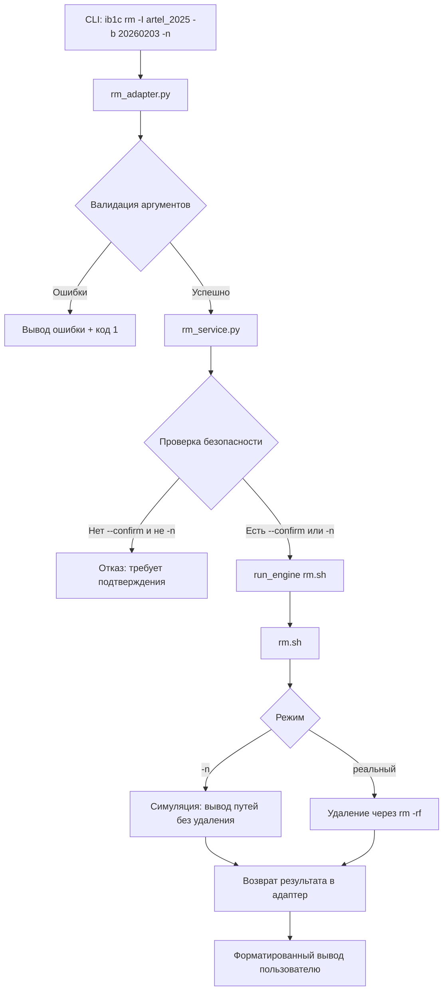

# Сервис `rm` — управление удалением бэкапов 1С

Сервис `rm` предоставляет безопасный и гибкий механизм удаления резервных копий информационных баз 1С с поддержкой фильтрации по временным диапазонам, симуляцией операций и защитой от случайного удаления через обязательное подтверждение для опасных операций.

## Файловая структура

### Корневые объекты проекта

```
/opt/1cv8/scripts/
├── orchestrator.py          # Единая точка входа (ib1c)
├── core/
│   ├── engine.py            # run_engine() — универсальный запуск скриптов
│   ├── utils.py             # Вспомогательные функции (парсинг дат)
│   └── exceptions.py        # Кастомные исключения (OrchestratorError)
├── engines/
│   └── config/global.sh     # Общие настройки (BACKUP_ROOT)
└── ib_list.conf             # Статический список ИБ для массовых операций
```

### Структура сервиса `rm`

```
rm/
├── adapters/cli/
│   └── rm_adapter.py        # CLI-интерфейс (парсинг аргументов)
├── services/
│   └── rm_service.py        # Бизнес-логика (валидация, безопасность)
└── engines/
    └── rm.sh                # Инфраструктурный движок (работа с ФС)
```

## Краткие примеры команд

```bash
# Симуляция удаления всех бэкапов ИБ
ib1c rm -I artel_2025 -n

# Удаление бэкапов старше даты (с подтверждением)
ib1c rm -I artel_2025 -b 20260203 -c

# Удаление в диапазоне дат
ib1c rm -I artel_2025 -a 20260202 -b 20260204 -n

# Глобальное удаление всех бэкапов всех ИБ (только в симуляции!)
ib1c rm -A -n
```

## Алгоритм работы и зависимости

### Цепочка вызовов



### Ключевые зависимости

| Файл            | Зависимости                                              | Назначение                                                                          |
| --------------- | -------------------------------------------------------- | ----------------------------------------------------------------------------------- |
| `rm_adapter.py` | `argparse`, `rm_service.RmService`, `core.utils.parse_*` | Парсинг аргументов, валидация конфликтов (`-t` vs `-b`), преобразование дат         |
| `rm_service.py` | `core.engine.run_engine`, `pathlib.Path`                 | Бизнес-правила безопасности, формирование аргументов для движка                     |
| `rm.sh`         | `bash`, `find`, `core/engines/config/global.sh`          | Низкоуровневая работа с файловой системой, фильтрация по дате через сравнение строк |

### Алгоритм фильтрации по дате в `rm.sh`

```bash
# Для каждой директории бэкапа (формат 20260203_140948):
backup_date="${dir_name:0:8}"  # Извлекаем ГГГГММДД

# --after 20260202 → оставить только даты > 20260202
if [[ -n "$AFTER" ]] && ! [[ "$backup_date" > "$AFTER" ]]; then continue; fi

# --before 20260204 → оставить только даты < 20260204
if [[ -n "$BEFORE" ]] && ! [[ "$backup_date" < "$BEFORE" ]]; then continue; fi
```

## Обработка ошибок

| Ошибка                                | Источник                             | Обработка                  | Пользовательский вывод                                |
| ------------------------------------- | ------------------------------------ | -------------------------- | ----------------------------------------------------- |
| Отсутствует `-I` или `-A`             | `rm_adapter.py`                      | Валидация аргументов       | `❌ Требуется указать --ib (-I) или --all (-A)`       |
| Конфликт флагов (`-t` + `-b`)         | `rm_adapter.py`                      | Проверка взаимоисключения  | `❌ --at (-t) несовместим с --before (-b)...`         |
| Неверный формат даты                  | `rm_adapter.py` → `core.utils`       | Исключение `ValueError`    | `❌ Ошибка формата --at: ...`                         |
| ИБ не найдена в хранилище             | `rm_service.py` → `_validate_ib()`   | Исключение `NotFoundError` | `❌ ИБ 'xxx' не найдена в хранилище`                  |
| Глобальное удаление без подтверждения | `rm_service.py` → `remove_all_ibs()` | Проверка флага `confirm`   | `❌ Требуется --confirm для удаления ВСЕХ бэкапов...` |
| Ошибка прав доступа к файлам          | `rm.sh`                              | Логирование через `log()`  | `⚠️ Не удалён (права?): /путь/к/бэкапу`               |
| Синтаксическая ошибка в скрипте       | `rm.sh`                              | Завершение с кодом 1       | `❌ Ошибка в скрипте: строка N`                       |

### Принципы безопасности

1. **Симуляция по умолчанию** — операции без `-n` требуют `-c`
2. **Глобальные операции** (`-A`) всегда требуют явного подтверждения
3. **Интерактивное подтверждение исключено** — все проверки на уровне сервиса
4. **Минимальные привилегии** — скрипты запускаются от `usr1cv8` (не от `root`)
